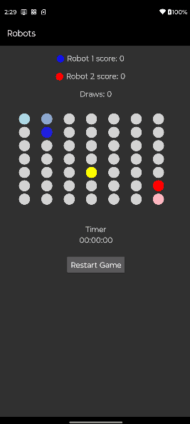

# Robots! Game

Robots! is a simple Android game where two robots navigate a grid to find a randomly placed prize token. This README provides an overview of the app, its features, and how to get started with the code.

## Table of Contents

- [Features](#features)
- [Demo](#demo)
- [Getting Started](#getting-started)
- [Project Structure](#project-structure)
- [Dependencies](#dependencies)
- [License](#license)

## Features

- Multi-round game: The game consists of multiple rounds.
- Random prize placement: At the start of each round, the prize token is randomly placed on the game board.
- Two robots: Two robots take turns navigating the grid.
- Legal moves: Robots can move left, right, up, or down to an unoccupied and unvisited space. Diagonal moves are not allowed.
- Scoring: The first robot to reach the prize wins one point.
- Continuously running simulation: The game session keeps track of the total score for each robot.
- If no robot can move, it is a draw and the Draw counter increases.
- There is a timer and a button to restart the game as well.
- The prize is represented by an yellow circle in the board whereas the Robot1 is a blue circle and the Robot2 is a red circle.

## Demo




## Getting Started

To get started with the Robots! game, follow these steps:

1. Clone the repository and find the project inside the Robots project folder.

   ```bash
   https://gitlab.com/renato.oliveira2808/android.git
  
## Project Structure

The application, due to its simplicity and no data being retrieved asynchronously from a server,  was strictured as a **MV (Model View) application**:
   - **Model:** A Robot class representing the robot and encapsulating in its interface all the needed methods related to such as **radomMove(), canMove(), visitedCells(), wins()**. 
   - **View**: The board consists in a GridLayout RecyclerView with each position of the board represented by an item of the RecycleView. The RecyclerView adapter (BoardAdapter.kt) implements the methods responsible for applying the updates to the GridLayout UI when each robot moves (**moveRobot()**), when the prize (**placePrize()**) is placed or when the game is restarted (**clear()**).
   - The game dynamic and the robots movements is implemented in the **startRound()** method, which is a method that uses coroutines to  run in a background thread so that the UI thread is not overloaded with processing necessary to move the robots. This method runs continuously moving the robots until on of then reaches a prize or the game reaches a draw state.
